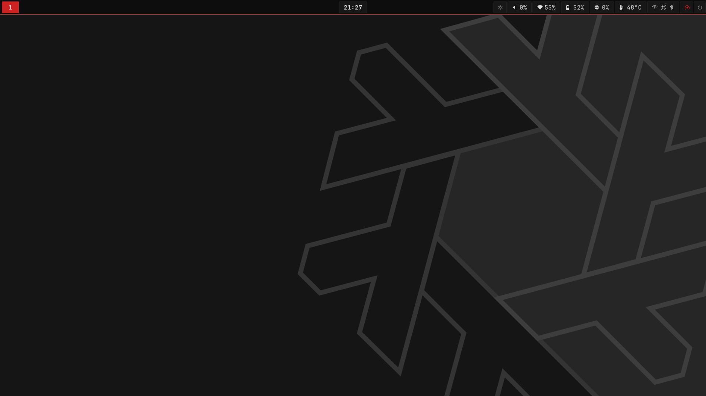
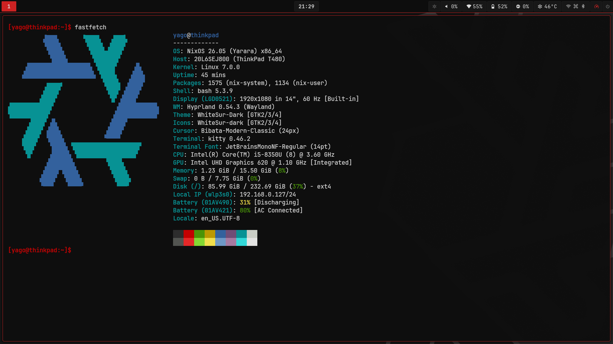
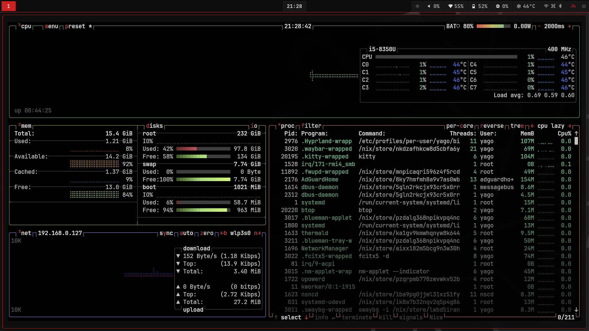

# ❄️ NixOS Multi-Host Configuration

A clean, modular, and reproducible **NixOS setup** built with **flakes** and **Home Manager as a NixOS module**.

This repository demonstrates a real-world multi-machine NixOS configuration, focused on **reusability, clarity, and reproducibility** — the same ideas used in infrastructure-as-code environments.

---

## 📸 Screenshots

---

## 🚀 Why this setup?

- Declarative system configuration
- One codebase, multiple machines
- Minimal duplication between hosts
- Clear separation of concerns
- Easy to extend and maintain

---

## ✨ Features

- ❄️ Flakes-first workflow
- 🖥️ Multi-host support (desktop, laptop, etc.)
- 🏠 Home Manager integrated as a NixOS module
- 🧩 Modular system design
- 🔁 Reproducible builds

---

## 🗂️ Repository Structure

    .
    ├── flake.nix                        # Entry point — defines all hosts
    ├── flake.lock
    ├── configuration.nix                # NixOS: imports modules/system/*
    ├── home.nix                         # Home Manager: imports modules/home/*
    ├── install.sh                       # Interactive installer (hardware config, flakes, rebuild)
    ├── hosts/
    │   ├── thinkpad/
    │   │   └── hardware-configuration.nix   # ThinkPad T480 (i915, TLP thresholds)
    │   ├── laptop/
    │   │   └── hardware-configuration.nix   # AMD laptop (amdgpu)
    │   └── desktop/
    │       └── hardware-configuration.nix   # AMD desktop (amdgpu)
    └── modules/
        ├── system/                      # NixOS (system-level) modules
        │   ├── boot.nix                 #   Nix settings, bootloader, kernel, journald
        │   ├── networking.nix           #   Hostname, NetworkManager, timezone, locale
        │   ├── audio.nix                #   PipeWire, WirePlumber, realtime limits
        │   ├── bluetooth.nix            #   Bluetooth hardware + Blueman
        │   ├── security.nix             #   CPU governor toggle script + sudo rule
        │   └── users.nix               #   User account, greetd, power, programs
        └── home/                        # Home Manager (user-level) modules
            ├── packages.nix             #   All user packages
            ├── theme.nix                #   GTK theme, icons, cursor (Graphite + Papirus)
            ├── hyprland.nix             #   Hyprland WM settings, keybinds, hyprpaper
            ├── waybar.nix               #   Status bar config + CSS
            ├── terminals.nix            #   Kitty terminal + Bash prompt
            ├── launchers.nix            #   Wofi launcher + CSS
            └── services.nix             #   Mako, Hyprlock, Hypridle, Hyprsunset timers

---

## 🧠 Design Overview

- **`flake.nix`**
  Auto-discovers all hosts from the `hosts/` directory. Passes `username` (read from the environment) and `hostName` as `specialArgs` to every module.

- **`configuration.nix` / `home.nix`**
  Thin import lists. Neither contains logic — they just wire up the modules.

- **`modules/system/`**
  NixOS modules for system-level concerns: boot, networking, audio, bluetooth, security, and users. Imported by `configuration.nix`.

- **`modules/home/`**
  Home Manager modules for user-level concerns: packages, theming, desktop environment, and services. Imported by `home.nix`.

- **`hosts/<name>/hardware-configuration.nix`**
  Machine-specific hardware config (GPU drivers, TLP battery thresholds, kernel params). Generated per-machine with `hwgen.sh`.

This layout scales naturally: adding a new machine means creating a `hosts/<name>/` directory; adding a new feature means creating a module file and adding it to the relevant import list.

---

## 🧪 Installation (NixOS Minimal)

This setup is designed to be applied on top of a **minimal NixOS installation**.

Run the interactive installer on the target machine:

    ./install.sh

It will walk you through three steps:

1. **Generate hardware configuration** — detects the current machine's hardware and writes `hosts/<host>/hardware-configuration.nix`
2. **Enable flakes** — adds `nix-command` and `flakes` to `~/.config/nix/nix.conf`
3. **Apply the system** — runs `sudo nixos-rebuild switch --flake .#<host> --impure`

> `--impure` is required so the flake can read `$SUDO_USER` to automatically detect the username of the user running the command.

---

## ⚡ Quick Start (TL;DR)

    ./install.sh

---

## 📌 Notes

- Hardware-specific state is isolated per host
- Shared logic lives in clean, reusable modules
- Suitable for personal setups or as a foundation for larger NixOS deployments

---

## 📄 License

Use it, learn from it, break it, improve it.
That’s the whole point 🙂
