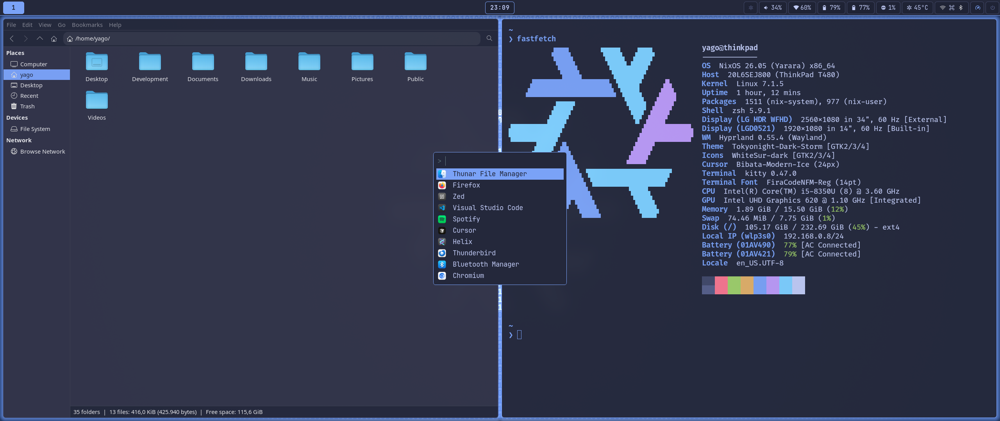
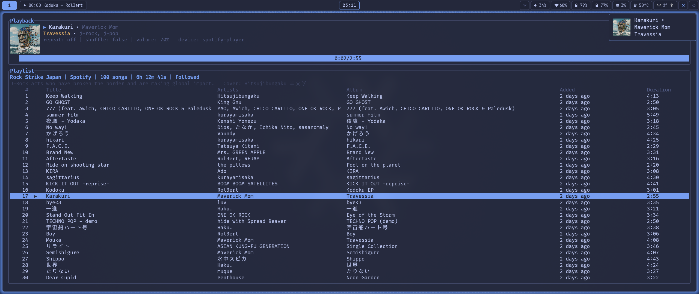

# ❄ NixOS Multi-Host Configuration

Personal [NixOS](https://nixos.org) flake with [Home Manager](https://github.com/nix-community/home-manager) on [Snowfall Lib](https://snowfall.org). NixOS 26.05, Hyprland, Tokyo Night Storm theme. Namespace: `mine`.

One rebuild applies system and user config together — no separate `home-manager switch`.

## Quick start

```bash
nh os switch              # default host (see programs.nh.flake)
nh os switch -H thinkpad  # explicit host
```

Flake attribute = directory name under `systems/x86_64-linux/` (e.g. `thinkpad` → `.#thinkpad`).

Alternative:

```bash
sudo nixos-rebuild switch --flake ~/.nix#thinkpad
```

Toggle installed software in `homes/x86_64-linux/<user>/package-groups.nix`. Group names live in `lib/packages.nix`. Format changed files with `nix fmt`.

## Screenshots






## Fresh install

From a minimal NixOS system, run `./install.sh` at the repo root. It:

1. Generates `systems/<arch>/<host>/hardware-configuration.nix` (strips Docker/Podman overlay mounts)
2. Scaffolds host and user dirs if missing — never overwrites an existing host `default.nix`
3. Enables flakes in `~/.config/nix/nix.conf`
4. Creates Lanzaboote Secure Boot keys when appropriate
5. Runs `nixos-rebuild switch --flake .#<host>`

Requires a git repository; the script `git add`s new files because flakes ignore untracked paths.

BIOS or no ESP at `/boot` → scaffolds GRUB. VMs default to `secureBoot = false`.

Secure Boot on bare metal: firmware Setup Mode → `sudo sbctl enroll-keys -m` → enable Secure Boot in firmware. Skip with `mine.boot.secureBoot = false` in the host config.

## Recipes

New host — run `./install.sh` or copy `systems/x86_64-linux/<host>/`. Shared NixOS modules are enabled in `systems/common.nix`.

Dual monitor (ultrawide + laptop panel, used on thinkpad/laptop):

```nix
imports = [
  ./hardware-configuration.nix
  (lib.${namespace}.dualMonitorHostModule "HDMI-A-1")
];
```

New user — create `homes/x86_64-linux/<username>/` (directory name must match the Unix user):

```nix
{ ... }: { imports = [ ./package-groups.nix ]; }
```

Shared Home Manager modules come from `homes/common.nix`.

New module — add `modules/nixos/<name>/` or `modules/home/<name>/` with `options.mine.<name>.enable`, then enable in `systems/common.nix` or `homes/common.nix`. Folder name = option name.

## Layout

```
flake.nix                          inputs + Snowfall wiring
install.sh                         bootstrap new hosts
lib/                               lib.mine.* helpers (collision-checked merge)
  modules.nix                      enable-modules
  packages.nix                     package group names + gating
  apps.nix                         terminal / Thunar / Yazi launch commands
  theme.nix                        Tokyo Night Storm palette + hex converters
  host.nix                         dual-monitor layout, Hyprland portal
systems/common.nix                 shared NixOS mine.* toggles
systems/x86_64-linux/<host>/       hostname, hardware, mine.host facts
homes/common.nix                   shared HM mine.* toggles
homes/x86_64-linux/<user>/         package-groups.nix + overrides
modules/nixos|home/<name>/         → mine.<name>.enable
modules/home/cli/                  tools.nix, broot.nix, zellij.nix, yazi.nix
modules/home/packages/groups/      packages per group
packages/                          custom derivations (≠ mine.packages)
```

Hosts: `thinkpad`, `laptop`, `desktop`.

## Conventions

- Opt-in modules via `mine.<name>.enable`, batched with `lib.mine.enable-modules` in `*/common.nix`
- Host facts on `mine.host.*` — shared modules read `osConfig`, not `if host ==`
- `homes/common.nix` uses literal `mine`, not `${namespace}` (Home Manager freeformType cycle)
- `packages/` = custom flake derivations; `mine.packages` = Home Manager user package groups
- `modules/home/cli/` is the one module with no `mine.<name>.enable` — the `cli` package group gates it
- stateVersion `26.05` · format with `nix fmt` (treefmt + nixfmt)
