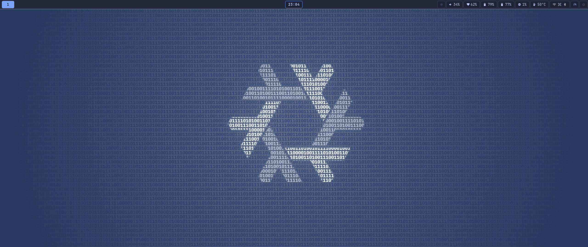
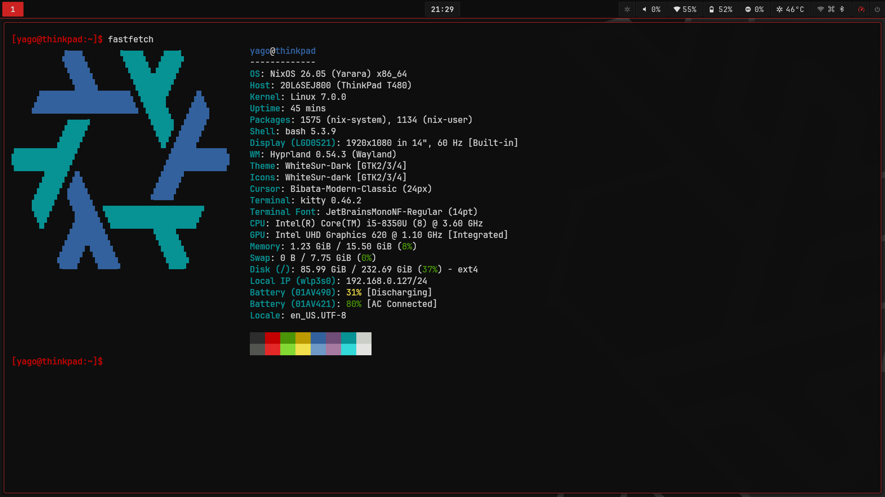
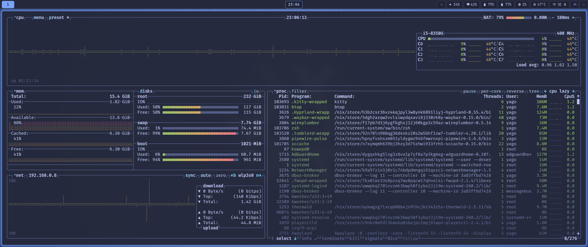

# ❄️ NixOS Multi-Host Configuration

A clean, modular, and reproducible **NixOS setup** built with **flakes**, **[Snowfall Lib](https://snowfall.org)**, and **Home Manager as a NixOS module**.

This repository demonstrates a real-world multi-machine NixOS configuration, focused on **reusability, clarity, and reproducibility** — the same ideas used in infrastructure-as-code environments.

---

## 📸 Screenshots

---

## 🚀 Why this setup?

- Declarative system configuration
- One codebase, multiple machines
- Minimal duplication between hosts
- Clear separation of concerns
- Easy to extend and maintain

---

## ✨ Features

- ❄️ Flakes-first workflow, wired up by **Snowfall Lib**
- 🖥️ Multi-host support (desktop, laptop, etc.) — hosts are auto-discovered from the filesystem
- 🏠 Home Manager integrated as a NixOS module, homes auto-discovered the same way
- 🧩 Modular system design — every feature is its own `<namespace>.<module>.enable` toggle
- 🔁 Reproducible builds

---

## 🗂️ Repository Structure

    .
    ├── flake.nix                        # Entry point — a thin snowfall-lib.mkFlake call
    ├── flake.lock
    ├── install.sh                       # Interactive installer (hardware config, flakes, rebuild)
    ├── lib/
    │   └── default.nix                  # Shared helper, merged into lib.yago.*
    ├── systems/
    │   └── x86_64-linux/                # <arch>-<format>, per Snowfall Lib's system targets
    │       ├── thinkpad/
    │       │   ├── default.nix              # Host entry point: hostname, imports, module toggles
    │       │   ├── hardware-configuration.nix
    │       │   └── thinkpad.nix              # i915, TLP thresholds, thinkfan, …
    │       ├── laptop/
    │       │   ├── default.nix
    │       │   ├── hardware-configuration.nix
    │       │   └── gpu.nix                   # amdgpu
    │       └── desktop/
    │           ├── default.nix
    │           └── hardware-configuration.nix
    ├── homes/
    │   └── x86_64-linux/
    │       └── yago/
    │           └── default.nix          # Home Manager base + module toggles (username inferred from this dir name)
    └── modules/
        ├── nixos/                       # NixOS (system-level) modules — one `yago.<name>.enable` toggle each
        │   ├── nix/                     #   Nix daemon, GC, stateVersion
        │   ├── boot/                    #   Bootloader, kernel, tmpfs, sysctls, firmware
        │   ├── logging/                 #   journald limits
        │   ├── networking/              #   NetworkManager
        │   ├── nh/                      #   nh CLI (nixos-rebuild/home-manager front-end) + weekly GC
        │   ├── dns/                     #   AdGuard Home + systemd-resolved
        │   ├── locale/                  #   Timezone, locale, console keymap
        │   ├── fonts/                   #   System fonts
        │   ├── input-method/            #   fcitx5 (Chinese + Japanese)
        │   ├── audio/                   #   PipeWire, WirePlumber, realtime limits
        │   ├── bluetooth/               #   Bluetooth hardware + Blueman
        │   ├── printing/                #   CUPS
        │   ├── power/                   #   CPU governor + toggle script
        │   ├── display/                 #   Hyprland, greetd, logind, XDG portal
        │   ├── desktop/                 #   Thunar, keyring, dconf, file services
        │   ├── programs/                #   Firefox, JDK, nix-ld
        │   ├── virtualisation/          #   Docker + Ollama
        │   ├── postgresql/              #   Postgres dev container
        │   ├── input-remapper/          #   Key/button remapping
        │   ├── tailscale/               #   WireGuard mesh VPN
        │   └── users/                   #   User account + session env
        └── home/                        # Home Manager (user-level) modules — one `yago.<name>.enable` toggle each
            ├── packages/                #   User packages + direnv
            ├── theme/                   #   GTK theme, icons, cursor (WhiteSur)
            ├── hyprland/                #   Hyprland WM settings + keybinds
            ├── waybar/                  #   Status bar config + CSS
            ├── launchers/               #   Wofi launcher + CSS
            ├── kitty/                   #   Kitty terminal
            ├── shell/                   #   Bash prompt
            ├── notifications/           #   Mako
            ├── lockscreen/              #   Hyprlock + Hypridle
            ├── nightshift/              #   Hyprsunset timers
            ├── mail/                    #   Proton Mail Bridge
            ├── thunar/                  #   Thunar file manager
            ├── input-remapper/          #   Per-user remap profiles
            └── spotify/                 #   spotify-player + theme

Every `.nix` file lives at `<module>/default.nix`, which is the layout [Snowfall Lib](https://snowfall.org) expects.

---

## 🧠 Design Overview

- **`flake.nix`**
  A single call to `snowfall-lib.mkFlake` with `snowfall.namespace = "yago"`. No manual host registration, no `specialArgs` plumbing — Snowfall Lib scans `systems/`, `homes/`, `modules/` and `lib/` and wires everything together based on the directory layout alone.

- **Every module is an opt-in `yago.<name>.enable` toggle**
  Each file under `modules/nixos/*/default.nix` and `modules/home/*/default.nix` declares its own `options.${namespace}.<name>.enable` (a plain `lib.mkEnableOption`) and wraps its entire body in `config = lib.mkIf cfg.enable { ... }`. Nothing is force-applied globally anymore — a module only takes effect where a system or home explicitly turns it on. This makes every module independently reusable and lets a future host cherry-pick only what it needs (e.g. a headless box could skip `display`, `bluetooth`, `input-method`).

- **`systems/x86_64-linux/<host>/default.nix`**
  Each host's entry point, kept intentionally thin: `networking.hostName`, `imports` for hardware config + any host-specific hardware file (e.g. `thinkpad.nix`), and one `yago = lib.yago.enable-modules [ ... ];` block listing which `modules/nixos/*` are active on that host. No other configuration belongs here.

- **`homes/x86_64-linux/yago/default.nix`**
  The single personal user's Home Manager base. The username and home directory are inferred from the directory name (`yago`) and, since it has no `@<host>` suffix, Snowfall Lib attaches it to every `x86_64-linux` host automatically. Like the systems, it stays thin: a few `home.file`/`xdg` basics plus a `yago = lib.yago.enable-modules [ ... ];` block toggling `modules/home/*`.

- **`lib/default.nix`**
  A tiny shared helper, merged by Snowfall Lib into `lib.yago.*`. `enable-modules` turns a list of module names into `{ <name>.enable = true; }` for each (via `lib.genAttrs`), which is what powers the one-line toggle blocks in every `systems/`/`homes/` file above.

- **`modules/nixos/`**
  Small, single-concern NixOS modules (one topic per directory: nix, boot, dns, locale, audio, power, display, …), each exported as `nixosModules.<name>` and gated behind its own `yago.<name>.enable` option.

- **`modules/home/`**
  Small, single-concern Home Manager modules (packages, theming, compositor, bar, terminal, per-service files), each exported as `homeModules.<name>` and gated behind its own `yago.<name>.enable` option.

- **No hardcoded username**
  `modules/nixos/users/default.nix` and `modules/nixos/power/default.nix` never hardcode `"yago"`. They read `config.snowfallorg.users` — the set Snowfall Lib already derives from `homes/x86_64-linux/*` — so shell/groups/sudo rules apply to whoever is actually declared there, even if a user is renamed or a second one is added.

- **Per-host differences** (e.g. Hyprland monitor layout) are resolved with Snowfall Lib's `host` argument, available in every home module — see `modules/home/hyprland/default.nix`.

This layout scales naturally: adding a new machine means creating a `systems/x86_64-linux/<name>/` directory with a `default.nix` that lists the modules it needs; adding a new feature means creating a module directory with its own `enable` option — no other file needs to change.

> **Two Nix module-system gotchas worth knowing** (both about using `${namespace}` as a dynamic attribute *name*, not as a value):
>
> 1. **`systems/x86_64-linux/<host>/default.nix`** — using `${namespace}` as an *implicit* top-level key (sitting directly beside `imports`) recurses, because Nix must know a module's attribute names before `config` — and therefore `_module.args.namespace` — exists. Wrapping the same block in an explicit `config = { ${namespace} = ...; };` attribute fixes it: the module's top-level shape is now just the static keys `imports`/`config`, so `namespace` is only needed once `config` is already being resolved. That's why every `systems/*/default.nix` uses `config = { ... };` instead of the shorthand.
> 2. **`homes/x86_64-linux/yago/default.nix`** — the same `config = { ... }` trick does *not* work here, even nested inside its own `imports`. Home Manager is wired in as the literal value of the NixOS option `home-manager.users.<name>`, which has a `freeformType` that inspects this module's merged config to validate it as part of resolving `home-manager.extraSpecialArgs` (where `namespace` itself comes from) — a genuine cycle, not a syntax issue, and `--impure` doesn't touch it either (it's a module-system dependency cycle, not an impurity problem). So this one file keeps the literal `yago` as its toggle-block attribute name. Every module it *imports* from `modules/home/` still reads/writes `config.${namespace}.*` dynamically without any issue — the limitation is scoped to this one entry point.

---

## 🧪 Installation (NixOS Minimal)

This setup is designed to be applied on top of a **minimal NixOS installation**.

Run the interactive installer on the target machine:

    ./install.sh

It will walk you through three steps:

1. **Generate hardware configuration** — detects the current machine's hardware, writes `systems/x86_64-linux/<host>/hardware-configuration.nix`, and scaffolds a `default.nix` the first time a host is configured
2. **Enable flakes** — adds `nix-command` and `flakes` to `~/.config/nix/nix.conf`
3. **Apply the system** — runs `sudo nixos-rebuild switch --flake .#<host>`

---

## ⚡ Quick Start (TL;DR)

    ./install.sh

---

## 📌 Notes

- Hardware-specific state is isolated per host
- Shared logic lives in clean, reusable modules
- Suitable for personal setups or as a foundation for larger NixOS deployments

---

## 📄 License

Use it, learn from it, break it, improve it.
That’s the whole point 🙂
